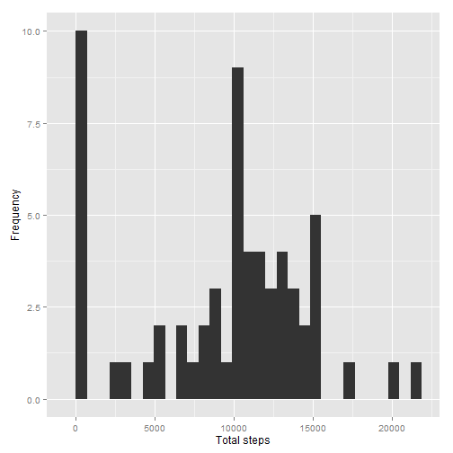

# Reproducible Research: Peer Assessment 1

## Loading and preprocessing the data

Read in the data.


```r
if (!file.exists("activity.csv")) {
    unzip("activity.zip")
}
activity <- read.csv("activity.csv")
```

## What is mean total number of steps taken per day?

First, calculate the mean number of steps for each day:


```r
total.steps <- tapply(activity$steps, activity$date, sum, na.rm = TRUE)
```

Let's look at the mean and median for the total steps per day:


```r
mean(total.steps)
```

```
## [1] 9354.23
```

```r
median(total.steps)
```

```
## [1] 10395
```

And let's take a look at the distribution of total number of steps per day with a histogram:


```r
library(ggplot2)
qplot(total.steps, xlab = "Total steps", ylab = "Frequency")
```

```
## stat_bin: binwidth defaulted to range/30. Use 'binwidth = x' to adjust this.
```

 

## What is the average daily activity pattern?

Calculate the mean steps for each five minute interval, and then put it in a data frame.


```r
averageStepsPerTimeBlock <- aggregate(x=list(meanSteps=activity$steps), by=list(interval=activity$interval), FUN=mean, na.rm=TRUE)
ggplot(data=averageStepsPerTimeBlock, aes(x=interval, y=meanSteps)) +
    geom_line() +
    xlab("5-minute interval") +
    ylab("average number of steps taken")
```

 

## Impute missing values, then make the histogram, finally calculate mean
## and median

Show number of missing values

```r
library(Hmisc)
countNoValues <- length(which(is.na(activity$steps)))
countNoValues
```

```
## [1] 2304
```

Fill in the missing values

```r
filledActivity <- activity
filledActivity$steps <- impute(activity$steps, fun=mean)
```

Make a histogram

```r
total.steps <- tapply(filledActivity$steps, filledActivity$date, sum)
qplot(total.steps, xlab = "Total steps", ylab = "Frequency")
```

```
## stat_bin: binwidth defaulted to range/30. Use 'binwidth = x' to adjust this.
```

 

Calculate mean and median

```r
mean(total.steps)
```

```
## [1] 10766.19
```

```r
median(total.steps)
```

```
## [1] 10766.19
```

Imputing the missing data has increased the mean and median number of steps.
